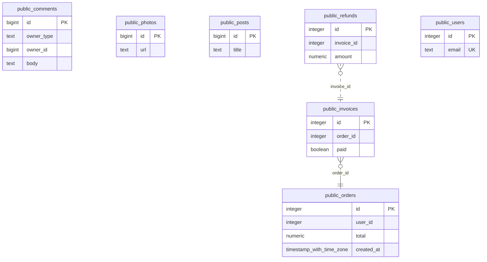

# Ledgerline

**The diagram of your database, derived from what your code actually does — and a
build that fails when the two disagree.**

```
npx ledgerline check          # one command, no database, no account
```

Every ER diagram tool starts from `CREATE TABLE` or a live connection, draws a
picture, and stops. The picture is stale within a week, and the relationships a
codebase really relies on — the `user_id` with no foreign key, the
`owner_type`/`owner_id` pair, the join table only the ORM knows about — never
appear on it.

Ledgerline starts from the other end. It reads the SQL your application runs
and the schema it declares, reconciles them into one model, draws it as a
single static HTML file, and runs in CI: a relationship the code uses that no
migration declares is a red build, and a pull request that touches the schema
gets a before-and-after diagram as a comment.

<!-- ledgerline:start -->

**3 undeclared joins** in the example schema below — counted by `ledgerline check`, not by anyone's say-so.



<!-- ledgerline:end -->

---

## Contents

[Quick start](#quick-start) · [What it reads](#what-it-reads) ·
[The commands](#the-commands) · [Configuration](#configuration) ·
[The findings](#the-findings) · [In CI](#in-ci) ·
[What it refuses to be](#what-it-refuses-to-be) · [Status](#status) ·
[Reference](#reference)

---

## Quick start

Node 22 or later. Nothing else — no database, no account, no daemon.

```
npx ledgerline check
```

That is the whole of the first run. It looks for migrations where migration
tools put them, falls back to whatever ORM file the repository has, reads the
SQL out of the repository, and prints one sentence per finding.

Real output, from [memos](https://github.com/usememos/memos) — a Go
application with 17 tables and exactly one `FOREIGN KEY` in its whole schema:

```
schema from store/migration/postgres · 187 statements in 64 sources · 120 not parsed
fail: The join in store/db/postgres/attachment.go:147 relies on public.attachment.memo_id → public.memo.id, which no constraint declares.
    store/db/postgres/attachment.go:147
warn: Rows in public.attachment may reference no public.memo: memo_id is nullable and no constraint checks it.
info: public.reaction.memo_id is named like a reference to memo and no constraint or query relates them.
```

**Read the first line before the findings.** It is the receipt: *187 statements
in 64 sources* means the tool had something to work with. *3 statements in 6
sources* means it did not, and a clean run then says so rather than claiming
everything agrees. A check that reads **no schema at all** fails, and prints
where it looked.

Then, in order of how often you will want them:

```
ledgerline model              # write ledgerline.model.json — commit it; git diff is the review
ledgerline explain "orders.user_id"   # the evidence, and the DDL that would close it
ledgerline report             # one self-contained HTML file
ledgerline baseline           # accept today's debt so the gate can go on today
```

### What it is doing

Two things that are supposed to agree, and where they do not. The **declared
schema** is what your migrations or your ORM say exists. The **claims** are the
relationships your queries rely on — every join, every `IN (SELECT …)`, every
`EXISTS`. Reconciling them gives a model where every relationship has a state,
and every state has a file and a line behind it.

| State | Meaning |
|---|---|
| `declared_and_used` | A constraint declares it and a query uses it. Nothing to say. |
| `declared_unused` | A constraint declares it; no query that was read uses it. A fact about your sample. |
| `used_undeclared` | **A query relies on it and no constraint declares it.** The thing that pages somebody at 2am. |

---

## What it reads

Ten sources. **Nine are files, and not one of those nine is ever executed** —
no Ruby process, no Python import, no `tsc`, no .NET SDK, no `rails runner`.
The tenth is a live database, read-only, and only when you hand it a URL.

| Source | Found by default |
|---|---|
| SQL migrations | `migrations`, `db/migrate`, `db/migrations`, `database/migrations`, `prisma/migrations`, `drizzle`, `supabase/migrations`, `server/migrations`, `src/migrations`, `sql/migrations` |
| A live PostgreSQL | `--database-url`, or `LEDGERLINE_DATABASE_URL` |
| Prisma | `prisma/schema.prisma`, `schema.prisma` |
| Rails | `db/schema.rb` |
| Django | `models.py`, and `.py` under a `models/` package |
| SQLAlchemy | the same search, split by what the file says it is |
| TypeORM | `*.entity.ts` |
| sequelize-typescript | `.ts` under a `models/` directory |
| Go — xorm and GORM | `.go` under a `model/` directory carrying a tag |
| EF Core | `**/Migrations/*ModelSnapshot.cs` |

Migrations win when they yield anything; an ORM file is read only when they do
not. **Never two at once** — two answers to one question is the thing this tool
exists to complain about.

**Where a convention cannot be reproduced, the line is reported and no edge is
drawn.** Rails derives a foreign key's column by singularising a table name, so
this repository contains an inflector, so there are plurals it will get wrong.
When the derived column does not exist, nothing is drawn and the line is listed
as unread. An invented edge is worse than a missing one, because the diagram
would look complete.

Queries are read from `.sql` files and from string literals in sixteen
languages. A string is offered to the parser only if it has the *shape* of a
statement — testing the first word instead meant Mastodon reported 1947 refused
statements, almost all of them interface strings like `"Delete & re-draft"`.

Full detail: [`docs/SOURCES.md`](docs/SOURCES.md).

---

## The commands

```
ledgerline check [--write] [--database-url URL]   recompute and fail on drift
ledgerline model [--database-url URL]             write ledgerline.model.json
ledgerline report [--out FILE]                    write the HTML report
ledgerline mermaid                                print an erDiagram for the README
ledgerline baseline                               accept today's findings so the gate can go on today
ledgerline explain <text>                         the evidence, and the DDL that would close it
ledgerline blast <table>                          what a change to it reaches
ledgerline history [table]                        when each table and column arrived
ledgerline usage                                  what the window touched, and what it did not
ledgerline pr                                     the pull-request comment, a sentence first
```

`--root DIR`, `--database-url URL`, `--no-color`, `--help`, `--version` work
on all of them. `check` exits **1** on any `fail` finding or a stale model
file, **0** otherwise.

### `explain` — the one to reach for first

```
$ ledgerline explain "attachment.memo_id"

fail: The join in store/db/postgres/attachment.go:147 relies on
      public.attachment.memo_id → public.memo.id, which no constraint declares.
  Many to one: public.memo.id is unique, so many rows may point at one.
  Evidence (1):
    query · store/db/postgres/attachment.go:147
      SELECT $? FROM attachment LEFT JOIN memo ON attachment.memo_id = memo.id
      LEFT JOIN space AS attachment_space ON memo.space_id = attachment_space.id
      WHERE $? ORDER BY attachment.updated_ts DESC
  This would close it. Put it in a migration; Ledgerline does not run it:
    ALTER TABLE public.attachment
      ADD CONSTRAINT attachment_memo_id_fkey
      FOREIGN KEY (memo_id)
      REFERENCES public.memo (id);
```

The cardinality is **derived from uniqueness**, never from the column's name.
The literals are `$?` — masked at read time, before anything was kept. And the
DDL is printed for a person to put in a migration: Ledgerline never runs it,
and never holds a connection that could.

### `blast` — what a change reaches

```
$ ledgerline blast memo

public.memo: 3 direct relationships, 1 one hop further
  direct   public.attachment.memo_id=public.memo.id (used undeclared)
  direct   public.memo.id=public.memo_share.memo_id (declared unused)
  direct   public.memo.space_id=public.space.id (used undeclared)
  one hop  public.space.id=public.space_member.space_id (used undeclared)
Places to look (3):
  store/db/postgres/attachment.go:147
  store/db/mysql/user.go:107
  store/db/postgres/user.go:94
```

### `baseline` — turning the gate on with debt already there

A repository with forty undeclared joins can turn the gate on **today**.
`ledgerline.baseline.json` is committed and reviewed like any other file, and
after it only *new* findings fail. The key strips line numbers and support
counts, so moving a query down a file does not resurrect debt somebody already
accepted. When a finding fails and a baseline exists, `check` prints the exact
line to paste, so you can accept **one** finding rather than re-baselining
everything.

Every command, with more real output: [`docs/USAGE.md`](docs/USAGE.md).

---

## Configuration

**`ledgerline.json` is optional, and so is every field in it.** Three of the six
repositories this has been run against needed no file at all.

The four settings that cover almost every real case:

```json
{
  "migrations": ["store/migration/postgres"],
  "queries": ["src", "internal"],
  "logs": ["tmp/pg_stat_statements.json"],
  "ignore": ["generated", "testdata"]
}
```

**A dialect can be a path.** One repository can hold more than one — memos
keeps `store/db/postgres`, `store/db/mysql` and `store/db/sqlite` side by side:

```json
{ "dialect": { "": "postgres", "store/db/mysql": "mysql" } }
```

If you do not set it, the summary line tells you:
*120 not parsed (68 of them in backticks — set "dialect" for those paths)*.

**A migrations entry can end in a glob**, for a directory holding one file per
dialect. Ory Kratos keeps 3483 of them in one place:

```json
{ "migrations": ["persistence/sql/migrations/sql/*.postgres.up.sql"] }
```

**A policy silences a class of finding** without touching the model — the
relationship stays on the diagram, still traceable to its line:

```json
{ "policy": { "declaredUnused": "ignore", "namingDrift": "warn" } }
```

Every field, the defaults, and four real worked configurations:
[`docs/CONFIGURATION.md`](docs/CONFIGURATION.md).

---

## The findings

| Code | Default | One line |
|---|---|---|
| `used_undeclared` | `fail` | a query relies on a relationship no constraint declares |
| `undeclared_table` | `fail` | a query names a table no schema declares |
| `declared_unused` | `warn` | a constraint nothing that was read uses |
| `orphan_side` | `warn` | a nullable referencing column with nothing checking it |
| `edge_removed` | `warn` | a relationship the committed model had and this one does not |
| `table_removed` | `warn` | a table the committed model had and this one does not |
| `name_without_join` | `info` | a `<x>_id` column that relates to nothing |
| `name_disagrees` | `info` | a column whose name says one table and whose join says another |
| `shared_parent` | `info` | a join between two columns that both reference the same third table |

**Three ways to make a finding go away, and they are not interchangeable.**
*Fix it* — `explain` prints the DDL. *Baseline it* — for debt you have decided
to pay down later. *Policy it* — for a class of finding your team does not want
to hear about at all. Filling a baseline with findings the tool should never
have made teaches everybody that the findings are noise.

What each one means, what it does *not* mean, and what to do:
[`docs/FINDINGS.md`](docs/FINDINGS.md).

---

## In CI

Everything the GitHub Action does is also one CLI command, so nothing is locked
inside it.

```yaml
- uses: actions/setup-node@v4
  with: { node-version: 22 }
- run: npx ledgerline check
```

That is enough to fail a pull request on drift. To post the comment as well,
give the job `pull-requests: write` and run `npx ledgerline pr`; the Action
edits one comment in place rather than adding a new one each push. The comment
leads with the finding, because a reviewer on a phone reads the first line and
the diagram is for the reviewer at a desk.

---

## What it refuses to be

- **Not a schema editor.** drawDB and dbdiagram.io are free and good.
- **Not a hosted service.** No tier, no account, no telemetry, no update check.
  It will not connect to your database unless you hand it a URL, and then only
  to read `pg_catalog`.
- **Not an AI that suggests tables.** It reports what the queries do and stops.
  No edge appears on the diagram without a line of SQL behind it.
- **It will not run the DDL it prints.** A diagram tool with write access to a
  database is a liability wearing a feature's clothes.

---

## Status

**Phase 5 of 5 — breadth. MySQL is in, and so are all the ORM sources.**

**MySQL** is normalised into the one grammar ([ADR-0004](docs/adr/0004-mysql-is-normalised-into-the-one-grammar-and-says-what-it-dropped.md))
and says what it dropped rather than drawing a diagram that looks complete. The
proof is a second 200-table corpus: the same generated schema as the PostgreSQL
one, from the same seed, written the way MySQL writes it, asserted to reconcile
to the same tables, columns, nullability, keys and all 375 foreign keys.

**What is not done: Phase 4's gate.** The check *has* been run against six real
public repositories — Mastodon, Outline, NetBox, memos, Ory Kratos and
Woodpecker CI — and every finding checked against the repository's own schema
file. [`docs/GATE-PHASE-4.md`](docs/GATE-PHASE-4.md) is the whole of it: nine
true findings on Mastodon, **four true undeclared relationships on memos with
the file and line of the join that relies on each**, one false finding found
and fixed, and twenty-three bugs in this tool — including a false positive on
Kratos that fired on every query in the repository
([ADR-0007](docs/adr/0007-a-join-through-a-shared-parent-is-not-a-missing-relationship.md)).
The gate asks for three such repositories and one has been found, so it is
still open.

**The numbers.** 93 tests across five packages, two against a real PostgreSQL,
three of them 200-world properties · 6 fixtures diffed on every build, two of
them 200 tables — the same schema in PostgreSQL and in MySQL · 10 gates, four
of them — the boundary, reachability, the fixtures and the tool itself — broken
on purpose every run · 7 ADRs · 10 commands · 10 places a schema can come
from, and the nine that are files are never run.

---

## Reference

**Using it**

| | |
|---|---|
| Install, and every command with real output | [`docs/USAGE.md`](docs/USAGE.md) |
| Every `ledgerline.json` field, with four real configurations | [`docs/CONFIGURATION.md`](docs/CONFIGURATION.md) |
| Every finding, and what to do about it | [`docs/FINDINGS.md`](docs/FINDINGS.md) |
| The ten places a schema can come from | [`docs/SOURCES.md`](docs/SOURCES.md) |

**Why it is the way it is**

| | |
|---|---|
| Read first | [`docs/00-PRODUCT-STATEMENT.md`](docs/00-PRODUCT-STATEMENT.md) |
| The phases and their exit gates | [`docs/ROADMAP.md`](docs/ROADMAP.md) |
| The gate run against six real repositories | [`docs/GATE-PHASE-4.md`](docs/GATE-PHASE-4.md) |
| Every dependency, and why | [`docs/TOOLCHAIN.md`](docs/TOOLCHAIN.md) |
| Decisions | [`docs/adr/`](docs/adr/) |
| Working notes | [`docs/JOURNAL.md`](docs/JOURNAL.md) |

## Licence

Apache-2.0.
