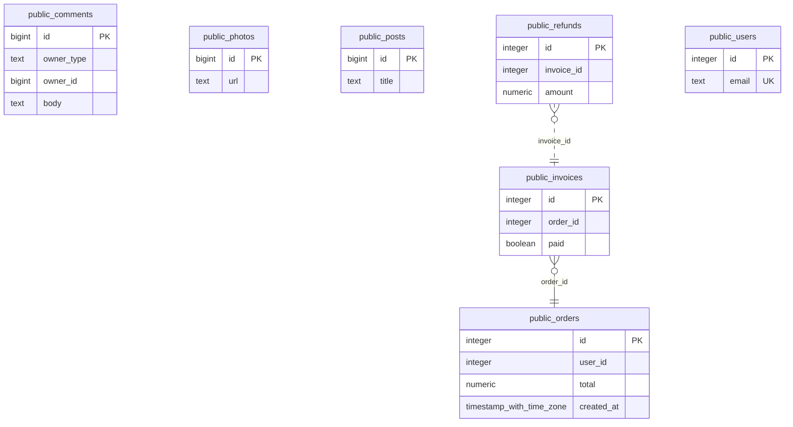

# Ledgerline

**The diagram of your database, derived from what your code actually does — and a
build that fails when the two disagree.**

Every ER diagram tool starts from `CREATE TABLE` or a live connection, draws a
picture, and stops. The picture is stale within a week, and the relationships a
codebase really relies on — the `user_id` with no foreign key, the
`owner_type`/`owner_id` pair, the join table only the ORM knows about — never
appear on it.

Ledgerline starts from the other end. It reads the SQL your application runs and
the schema it declares, reconciles them into one model, draws it as a single
static HTML file, and runs in CI: a relationship the code uses that no migration
declares is a red build, and a pull request that touches the schema gets a
before-and-after diagram as a comment.

```
npx ledgerline check          # one command, no database, no account
```

<!-- ledgerline:start -->

**3 undeclared joins** in the example schema below — counted by `ledgerline check`, not by anyone's say-so.



<!-- ledgerline:end -->

## Status

**Phase 5 of 5 — breadth. MySQL is in, and so are all five ORM sources.**
`ledgerline check` runs on a repository with no configuration and no database,
finds the relationships the queries rely on that no migration declares, and
exits non-zero. There is a baseline for old codebases, `explain` with the DDL
that would close a finding, `blast` for what a change reaches, `history` from
the migration files, `usage` for what a query log's window touched and what it
did not, a static HTML report, a Mermaid diagram, and a GitHub
Action that posts one pull-request comment and edits it in place. The tool
gates itself: `make self-check` plants a drift in its own fixture and requires
the check to fail.

**MySQL** is normalised into the one grammar (ADR-0004) and says what it
dropped rather than drawing a diagram that looks complete. The proof is a
second 200-table corpus: the same generated schema as the PostgreSQL one, from
the same seed, written the way MySQL writes it, asserted to reconcile to the
same tables, columns, nullability, keys and all 375 foreign keys.

**Rails `db/schema.rb`, Django `models.py`, SQLAlchemy models, TypeORM
entities, sequelize-typescript models, Go structs with xorm or GORM tags, and
EF Core model snapshots** are read as text and **never executed**
(ADR-0005), for the repositories that contain no SQL at all. Where a
convention cannot be reproduced — a Rails plural the inflector does not know,
a relation to a class in a file the reader never saw — the line is reported as
unread and no edge is drawn. An invented edge is worse than a missing one,
because the diagram would look complete.

**What is not done:** Phase 4's gate. The check *has* been run against six
real public repositories — Mastodon, Outline, NetBox, memos, Ory Kratos and
Woodpecker CI — and every
finding checked against the repository's own schema file.
[`docs/GATE-PHASE-4.md`](docs/GATE-PHASE-4.md) is the whole of it: nine true
findings on Mastodon, **four true undeclared relationships on memos with the
file and line of the join that relies on each**, one false finding found and
fixed, and twenty-three bugs in this tool — including a false positive on
Kratos that fired on every query in the repository (ADR-0007). The gate asks
for three such repositories and one has been found, so it is still open.

```
npx ledgerline check
```

**The numbers.** 93 tests across five packages, two against a real PostgreSQL,
three of them 200-world properties · 6 fixtures diffed on every build, two of
them 200 tables — the same schema in PostgreSQL and in MySQL · 10 gates, four
of them — the boundary, reachability, the fixtures and the tool itself — broken
on purpose every run · 7 ADRs · 10 commands · 9 places a schema can come
from, and none of them is run.

| | |
|---|---|
| Read first | [`docs/00-PRODUCT-STATEMENT.md`](docs/00-PRODUCT-STATEMENT.md) |
| The phases and their exit gates | [`docs/ROADMAP.md`](docs/ROADMAP.md) |
| Every dependency, and why | [`docs/TOOLCHAIN.md`](docs/TOOLCHAIN.md) |
| Decisions | [`docs/adr/`](docs/adr/) |
| Working notes | [`docs/JOURNAL.md`](docs/JOURNAL.md) |

## What it refuses to be

Not a schema editor (drawDB and dbdiagram.io are free and good). Not a hosted
service that holds a connection string. Not an AI that suggests tables. Every
edge on the diagram is traceable to a line of SQL or DDL, and the tool runs
where the code runs.

## Licence

Apache-2.0.
